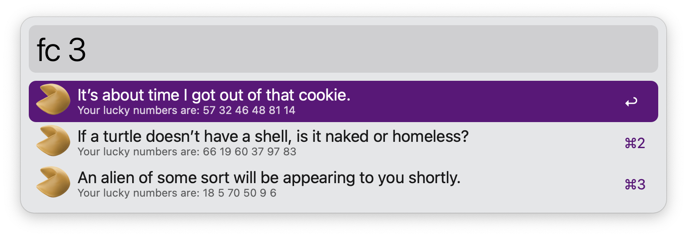
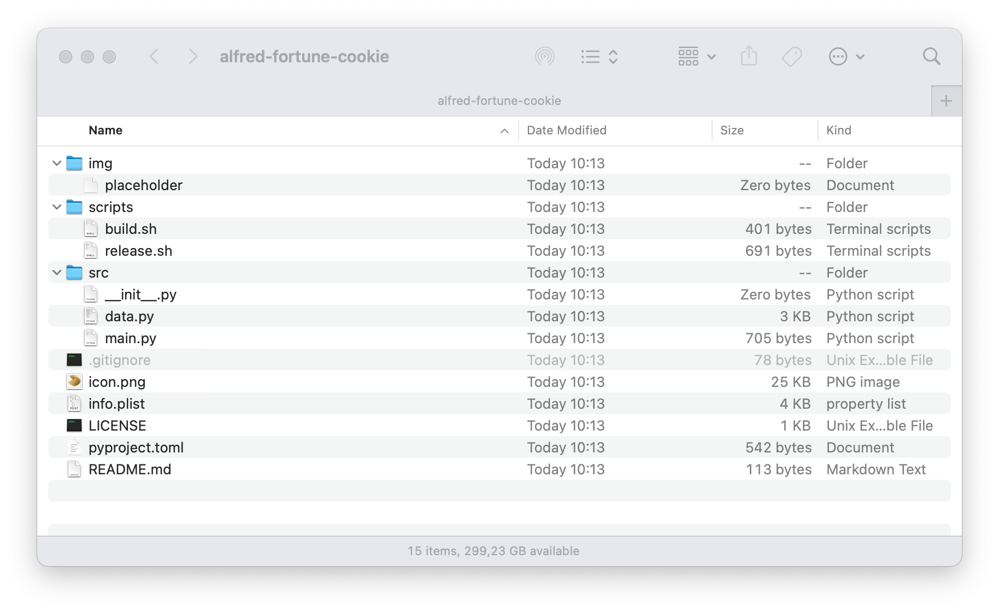

## ALFRED-PYFLOW-COOKIECUTTER

Project to generate simple alfred workflows using alfred-pyflow 🍪


### REQUIREMENTS

### POETRY dependency manager


* [official docs](https://python-poetry.org/docs)
* [list of commands](https://python-poetry.org/docs/cli)


#### install

```bash
brew install poetry

git clone git@github.com:fedecalendino/alfred-pyflow-cookiecutter.git

cd alfred-pyflow-cookiecutter

poetry install
```

### USAGE

```bash
# create and change temporary directory
mkdir tmp ; cd tmp

# run the cookie cutter and follow the prompts
poetry run cookiecutter ../

# change to the generated project
cd user.workflow.<UUID>

# install poetry for the project
poetry install

# build binary file
./build.sh

cd ..
```


### INSTALL
```bash
# copy the generated project to alfred's workflows directory
cp user.workflow.<UUID> $HOME/Alfred/Alfred.alfredpreferences/workflows/
```


When all the default options are selected, a workflow named `Fortune Cookie` will be added to your workflows:

```bash
workflow_name [Fortune Cookie]:
workflow_description [Read your fortune!]:
Select workflow_category:
1 - Productivity
2 - Tools
3 - Internet
Choose from 1, 2, 3 [1]:
workflow_emoji [🥠️]:
workflow_version [0.1.0]:
action_keyword [fc]:
action_placeholder_title [Get your fortune cookie here!]:
action_placeholder_subtitle [fc [amount: default=1]]:
author_name [Fede Calendino]:
author_email [fede@calendino.com]:
github_organization [fedecalendino]:
github_repository [alfred-fortune-cookie]:
github_url [https://github.com/fedecalendino/alfred-fortune-cookie]:
```





### FILE STRUCTURE

Anything can be changed after the cookiecutter is used by following this folder structure:

* **img**: placeholder directory to storage images.
* **scripts**: set of bash scripts to generate new releases.
  * `./scripts/release.sh` will generate a release using the version indicated in `pyproject.toml`
* **src**: directory where all your python source code files should be.
* **icon.png**: image used by **alfred** for the workflow's icon.
  * this has to be replaced manually, is not part of the cookiecutter flow.
* **info.plist**: file generated by **alfred** for the configuration of the workflow.
  * this file *should not be edited by hand* as a mistake can break your workflow.
* **LICENSE**: MIT license file generated for the workflow.
* **pyproject.toml**: file used by [poetry](https://python-poetry.org/) to describe the project.
* **README.md**: markdown file where you should add some documentation of the workflow and how to use it.





# USAGE

To give it a try you can run the following script

```bash
poetry run cookiecutter {location of this project}  # run the cookie cutter
cd */                                               # change to the generated directory
poetry install                                      # install the python environment
./scripts/release.sh                                # execute the release script
open ./releases/*                                   # open the generated release file with Alfred.app         
```
